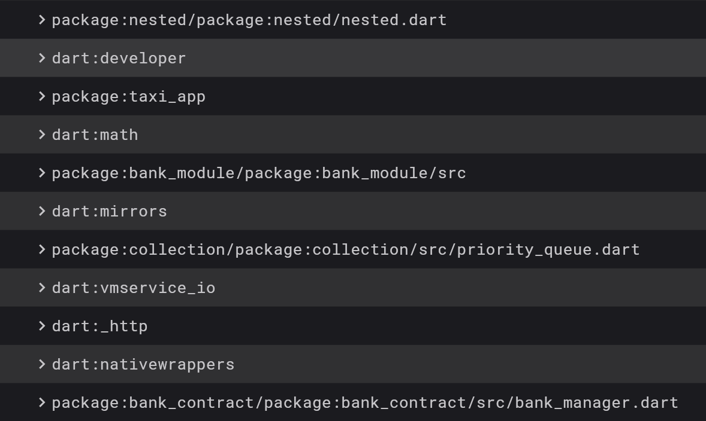
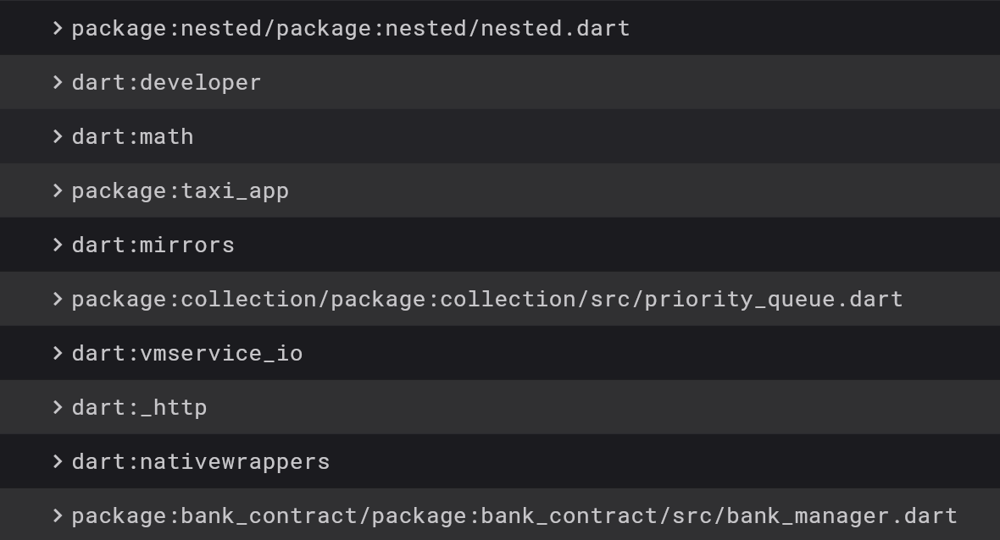

# Let's Tree Shake

Небольшой проект-пример подготовленный для доклада на Surf Flutter Meetup.

_Не полностью доделана часть с нативном, нет удаления лишнего нативного кода_
_Я просто не придумал, что и как удалять 🫣_

### Как удалять зависимости

##### Flavors

Финальная сборка завязана на Flavor.
Чтобы собрать приложение с исключением банка достаточно собрать примерно таким образом:

```sh
flutter build apk --flavor unbanked
```

Чтобы исключить сборку, можно запустить любой другой флейвор:

```sh
flutter build apk --flavor banked
```

К сожалению, тут есть куча нюансов и особенностей.
К примеру, Android требует выбора хоть какого-то флейвора, если они определены, в тот же момент iOS
может собираться без указания флейвора.

##### dart-define

Если вам интересно посмотреть, как можно удалять через аргумент `dart-define`, то можно вернуться к [этому коммиту](https://github.com/Vorkytaka/lets_tree_shake/tree/0c15b7386ea79aa8a2164de775d5df283ed83a7a) и посмотреть реализацию оттуда.
Чтобы там включить или выключить банк достаточно собрать приложение примерно таким образом:
```sh
flutter build apk --dart-define=BANK_ENABLED=true|false
```

### Как проверить удалилось ли?

В репозиторий уже включены файлы с анализом размера:

- [С банком](data/banked_apk-code-size-analysis.json)
- [Без банка](data/unbanked_apk-code-size-analysis.json)

Результат такой:

| С банком | Без банка |
| - | - |
|   |   |

Как видим, в версии с банком присутствует дополнительная зависимость в лице реализации банка.

##### Я тебе не верю!

И это правильно!
Чтобы проверить самим, можно собрать приложение для анализа размера и проверить самим.
Для этого определяем конкретный тип сборки и добавляем флаг на анализ размера:
```sh
flutter build apk --target-platform android-arm64 --analyze-size --flavor unbanked
```

И полученную json'ку скармливаем в [Devtools](https://docs.flutter.dev/tools/devtools/app-size).